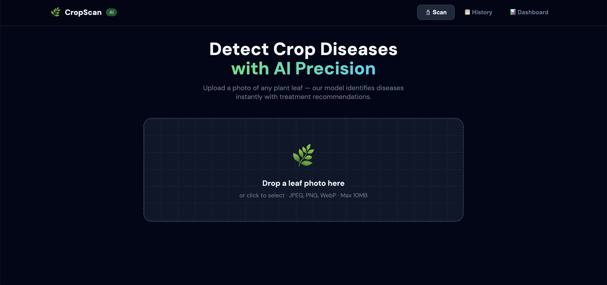
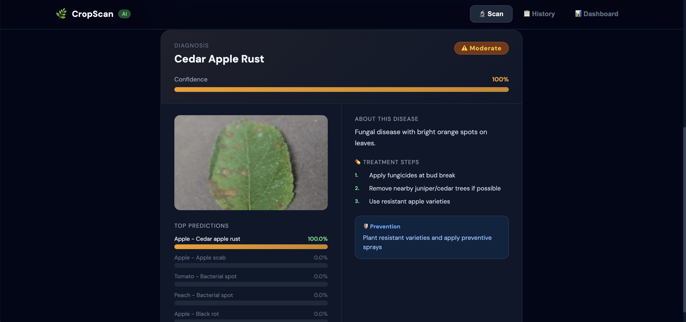
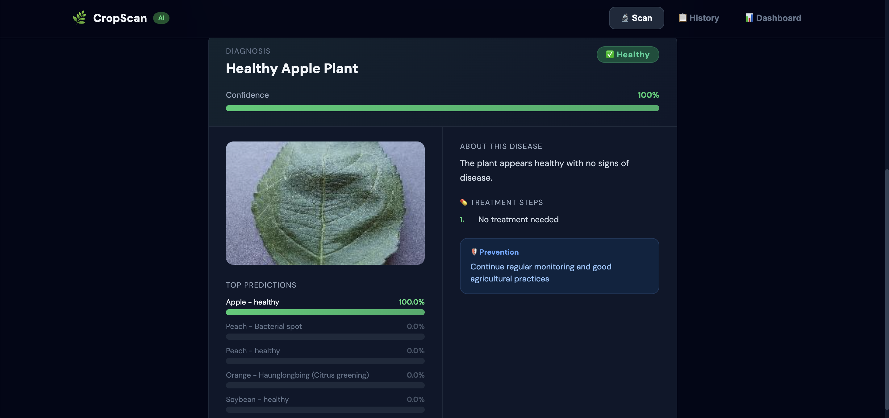
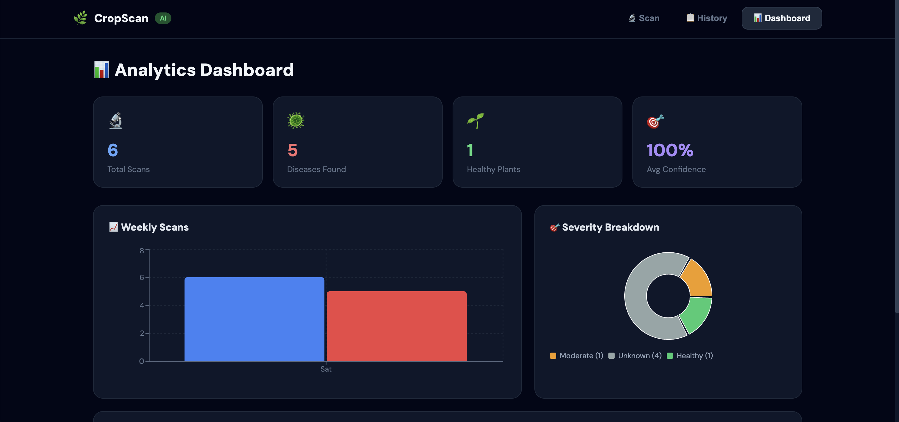
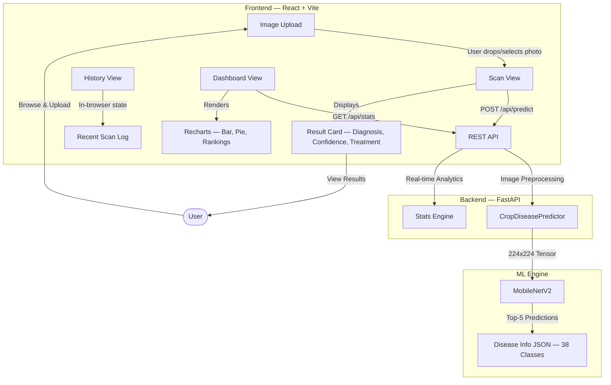

# CropScan AI — Plant Disease Detection System

**CropScan AI** is a state-of-the-art agricultural diagnostic tool that leverages deep learning to identify 38 types of plant diseases from simple leaf photographs. Designed for accessibility and speed, it provides farmers and gardeners with instant treatment advice and a comprehensive analytics dashboard.

### Live Preview: [https://crop-disease-ai-6w67.onrender.com/](https://crop-disease-ai-6w67.onrender.com/)

---

## Usage & Screenshots

### App Screenshots

| Home (Image Upload) | Diagnosis Result |
| :---: | :---: |
|  |  |

| Healthy Leaf View | Analytics Dashboard |
| :---: | :---: |
|  |  |

1. **Upload**: Drag and drop a photo or browse your files.
2. **Analyze**: The AI model (MobileNetV2) processes the image in milliseconds.
3. **Result**: View detailed diagnosis, confidence score, and treatment steps.
4. **Dashboard**: Track your history and view global disease trends in real-time.

---

## Installation & Setup

### 1. Prerequisites
- **Git**: For cloning the repository.
- **Docker Desktop**: [Download and install](https://www.docker.com/products/docker-desktop/) Docker. Ensure it is running before proceeding.
- **Python 3.11+**: Optional, only required for local non-dockerized training or development.

### 2. Getting Started
Clone the repository and navigate to the project directory:
```bash
git clone https://github.com/masumbillah21/crop-disease-ai-detector.git
cd crop-disease-docker
```

### 3. Environment Configuration
Create a `.env` file from the example:
```bash
cp .env.example .env
```
*(No further environmental changes are typically required for local setup)*

### 4. Running the Application (Local)
Choose one of the following methods:

#### Method A: One-Click Setup (Recommended)
This script handles dependency checks, `.env` creation, and starts the Docker containers.
- **Linux / macOS**: `chmod +x setup.sh && ./setup.sh`
- **Windows**: Double-click `setup.bat`

#### Method B: Docker Compose
Standard command for containerized environments:
```bash
docker compose up -d --build
```

#### Method C: Makefile (Convenience)
If you have `make` installed:
```bash
make start
```

### 5. Service URLs
Once the containers are running, access the services:
- **Web App**: [http://localhost](http://localhost) (Mapping to port 80)
- **API Documentation**: [http://localhost/api/docs](http://localhost/api/docs)
- **Production URL**: [https://crop-disease-ai-6w67.onrender.com/](https://crop-disease-ai-6w67.onrender.com/)

---

## Model Initialization & Training

The project comes with a demo model (`backend/model/crop_disease_model`). To use the full dataset or retrain:

1. **Download Dataset**:
   ```bash
   make download-dataset
   ```
2. **Train Model**:
   ```bash
   make train
   ```
3. **Deploy to App**:
   Restart the backend container to load the new weights:
   ```bash
   make restart-api
   ```

---

## Troubleshooting

- **Port 80 Conflict**: If port 80 is already in use by another service (like Apache or Nginx), change the mapping in `docker-compose.yml` for the `frontend` service (e.g., `"8080:80"`).
- **Docker Not Running**: Ensure Docker Desktop is active. Run `docker info` to verify.
- **Build Errors**: Try a clean build: `make clean && make start`.

---

## Project Architecture



### Folder Structure

```
crop-disease-docker/
├── backend/                  # FastAPI server
│   ├── main.py               # API endpoints & static file serving
│   ├── config.py             # Centralized environment configuration
│   ├── demo_data.json        # Fallback demo predictions
│   ├── requirements.txt      # Python dependencies
│   └── model/                # ML pipeline
│       ├── predict.py        # Inference logic
│       ├── train_model.py    # Training script
│       ├── download_dataset.py
│       ├── crop_disease_model.h5
│       ├── class_names.json
│       └── disease_info.json
├── frontend/                 # React + Vite
│   ├── src/App.jsx           # Main UI component
│   ├── vite.config.js
│   ├── nginx.conf            # Dev proxy config
│   └── index.html
├── docs/                     # Documentation
├── Dockerfile                # Production multi-stage build
├── docker-compose.yml        # Local dev (2-service)
├── setup.sh / setup.bat      # Quick start scripts
└── Makefile                  # Build commands
```

---

## AI Methodology
Detailed documentation of our AI approach can be found in [MODEL_DOCUMENTATION.md](./docs/MODEL_DOCUMENTATION.md).

- **Architecture**: MobileNetV2 (Pre-trained on ImageNet).
- **Dataset**: PlantVillage (54,303 images, 38 classes).
- **Output**: Display Name, Severity Level, Confidence, Treatment, and Prevention.

---

## Tech Stack

| Layer | Technology |
| :--- | :--- |
| **AI/ML** | TensorFlow 2.15, MobileNetV2 |
| **Backend & Hosting** | FastAPI, Uvicorn, Python 3.11 |
| **UI** | React 18, Vite, Recharts |
| **Production Architecture** | Single Container (Multi-stage Build) |
| **DevOps** | Docker, Docker Buildx |
| **Documentation** | [Project Proposal](./docs/PROJECT_PROPOSAL.md), [Model Methodology](./docs/MODEL_DOCUMENTATION.md), [Final Report](./docs/FINAL_REPORT.md) |

---

## Project Documentation

Detailed project records are maintained in the `docs/` directory:
- [**Project Proposal**](./docs/PROJECT_PROPOSAL.md): Initial vision, problem statement, and technical approach.
- [**AI Model Methodology**](./docs/MODEL_DOCUMENTATION.md): Deep dive into MobileNetV2 architecture, training, and performance.
- [**Final Report**](./docs/FINAL_REPORT.md): Comprehensive summary of outcomes, challenges, and future work.

---

## Deployment

### Docker Hub (Recommended)
You can easily build and push this application to Docker Hub:

1. **Login to Docker Hub**:
   ```bash
   docker login
   ```
2. **Build & Push**:
   ```bash
   make push DOCKER_USER=your_username
   ```
   *(This will create a single, optimized multi-stage image at `your_username/cropscan-ai:latest`)*

### Cloud Hosting
The resulting image is cloud-agnostic and can be deployed to:
- **Render**: Connect your GitHub repo and use the root `Dockerfile`.
- **AWS App Runner / ECS**: Push to ECR or Docker Hub.
- **Google Cloud Run**: `gcloud run deploy`.

Ensure your `.env` variables (like `PORT`) are correctly set in your cloud provider's dashboard.

---
*Developed for the AI Crop Disease Challenge.*

