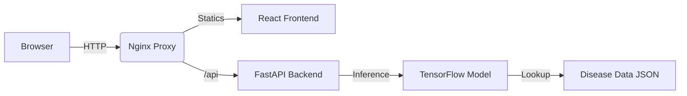

# CropScan AI — Plant Disease Detection System

**CropScan AI** is a state-of-the-art agricultural diagnostic tool that leverages deep learning to identify 38 types of plant diseases from simple leaf photographs. Designed for accessibility and speed, it provides farmers and gardeners with instant treatment advice and a comprehensive analytics dashboard.

---

## Usage & Screenshots

*(Screenshots will be placed here after deployment/local capture)*

1. **Upload**: Drag and drop a photo or browse your files.
2. **Analyze**: The AI model (MobileNetV2) processes the image in milliseconds.
3. **Result**: View detailed diagnosis, confidence score, and treatment steps.
4. **Dashboard**: Track your history and view global disease trends in real-time.

---

## Quick Start

### Prerequisites
- [Docker Desktop](https://www.docker.com/products/docker-desktop/) installed and running.

### One-Command Setup
| OS | Command |
| :--- | :--- |
| **Linux / macOS** | `chmod +x setup.sh && ./setup.sh` |
| **Windows** | Double-click `setup.bat` |

### Service URLs
- **Main Application**: [http://localhost](http://localhost)
- **API Documentation**: [http://localhost/api/docs](http://localhost/api/docs)

---

## Project Architecture

### Folder Structure
- `frontend/`: React 18 application with Recharts analytics.
- `backend/`: FastAPI server with async endpoints.
- `backend/model/`: MobileNetV2 model files, training scripts, and disease database.
- `docker-compose.yml`: Orchestration for the 2-service architecture.

---

## AI Methodology
Detailed documentation of our AI approach can be found in [MODEL_DOCUMENTATION.md](./MODEL_DOCUMENTATION.md).

- **Architecture**: MobileNetV2 (Pre-trained on ImageNet).
- **Dataset**: PlantVillage (54,303 images, 38 classes).
- **Output**: Display Name, Severity Level, Confidence, Treatment, and Prevention.

---

## Tech Stack

| Layer | Technology |
| :--- | :--- |
| **AI/ML** | TensorFlow 2.15, MobileNetV2 |
| **Service** | FastAPI, Uvicorn, Python 3.11 |
| **UI** | React 18, Vite, Recharts |
| **Reverse Proxy** | Nginx |
| **DevOps** | Docker, Docker Compose |

---

## Deployment

This application is designed to be cloud-agnostic. For production deployment:
1. Ensure `.env` is properly configured.
2. Build optimized images: `docker compose -f docker-compose.yml build`.
3. Deploy to any container orchestration service (AWS ECS, Google Cloud Run, DigitalOcean App Platform, or Render).

---
*Developed for the AI Crop Disease Challenge.*

