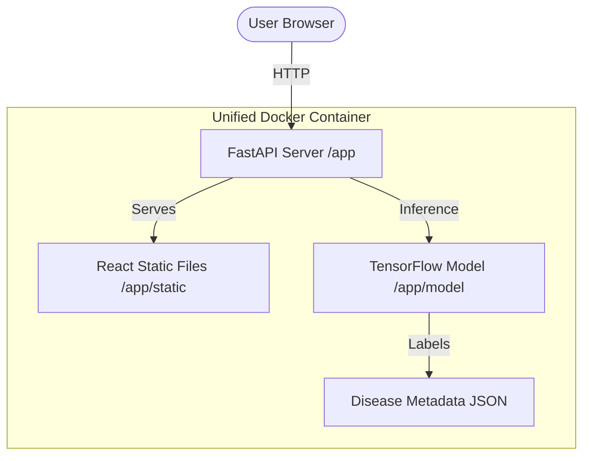

# CropScan AI — Plant Disease Detection System

**CropScan AI** is a state-of-the-art agricultural diagnostic tool that leverages deep learning to identify 38 types of plant diseases from simple leaf photographs. Designed for accessibility and speed, it provides farmers and gardeners with instant treatment advice and a comprehensive analytics dashboard.

### Live Preview: [https://crop-disease-ai-6w67.onrender.com/](https://crop-disease-ai-6w67.onrender.com/)

---

## Usage & Screenshots

*(Screenshots will be placed here after deployment/local capture)*

1. **Upload**: Drag and drop a photo or browse your files.
2. **Analyze**: The AI model (MobileNetV2) processes the image in milliseconds.
3. **Result**: View detailed diagnosis, confidence score, and treatment steps.
4. **Dashboard**: Track your history and view global disease trends in real-time.

---

## Quick Start

### Prerequisites
- [Docker Desktop](https://www.docker.com/products/docker-desktop/) installed and running.

### One-Command Setup
| OS | Command |
| :--- | :--- |
| **Linux / macOS** | `chmod +x setup.sh && ./setup.sh` |
| **Windows** | Double-click `setup.bat` |

### Service URLs
- **Application**: [http://localhost:8000](http://localhost:8000)
- **API Documentation**: [http://localhost:8000/api/docs](http://localhost:8000/api/docs)
- **Production URL**: [https://crop-disease-ai-6w67.onrender.com/](https://crop-disease-ai-6w67.onrender.com/)

---

## Project Architecture

### Folder Structure
- `backend/`: FastAPI implementation, API logic, and models.
- `frontend/`: React source code (built via multi-stage Docker).
- `docs/`: Project documentation (Proposal, Methodology, Reports).
- `Dockerfile`: Unified multi-stage build for production.
- `docker-compose.yml`: Local development orchestration.

---

## AI Methodology
Detailed documentation of our AI approach can be found in [MODEL_DOCUMENTATION.md](./docs/MODEL_DOCUMENTATION.md).

- **Architecture**: MobileNetV2 (Pre-trained on ImageNet).
- **Dataset**: PlantVillage (54,303 images, 38 classes).
- **Output**: Display Name, Severity Level, Confidence, Treatment, and Prevention.

---

## Tech Stack

| Layer | Technology |
| :--- | :--- |
| **AI/ML** | TensorFlow 2.15, MobileNetV2 |
| **Backend & Hosting** | FastAPI, Uvicorn, Python 3.11 |
| **UI** | React 18, Vite, Recharts |
| **Production Architecture** | Single Container (Multi-stage Build) |
| **DevOps** | Docker, Docker Buildx |
| **Documentation** | [Project Proposal](./docs/PROJECT_PROPOSAL.md), [Model Methodology](./docs/MODEL_DOCUMENTATION.md), [Final Report](./docs/FINAL_REPORT.md) |

---

## Project Documentation

Detailed project records are maintained in the `docs/` directory:
- [**Project Proposal**](./docs/PROJECT_PROPOSAL.md): Initial vision, problem statement, and technical approach.
- [**AI Model Methodology**](./docs/MODEL_DOCUMENTATION.md): Deep dive into MobileNetV2 architecture, training, and performance.
- [**Final Report**](./docs/FINAL_REPORT.md): Comprehensive summary of outcomes, challenges, and future work.

---

## Deployment

This application is designed to be cloud-agnostic. For production deployment:
1. Ensure `.env` is properly configured.
2. Build optimized images: `docker compose -f docker-compose.yml build`.
3. Deploy to any container orchestration service (AWS ECS, Google Cloud Run, DigitalOcean App Platform, or Render).

---
*Developed for the AI Crop Disease Challenge.*

